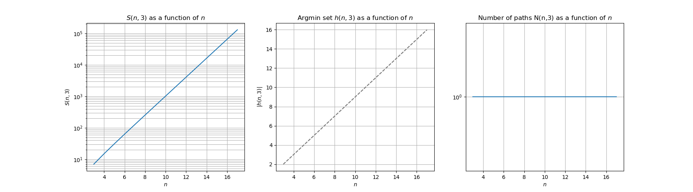
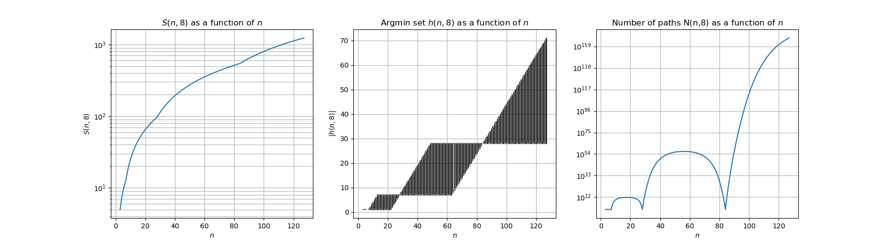

<html>
<head>

</head>	
<body>
# Multi-peg Tower of Hanoi

We consider **Stewart's algorihm** for solving the **multi-peg Hanoi Tower problem**.

## Algorithm

Stewart's algorithm solves the p-peg n-disc from source to destination as follows:

- choose a height \\(h\in\left\\{1,\dots,n-1\right\\}\\) (see below) ;
- move the \\((n-h)\\)-high upper part of the tower to any peg different from source and destination, say number peg \\(i\\) ;
- move the \\(h\\)-high lower part from source to destination using all pegs except \\(i\\) ;
- move the \\((n-h)\\) from \\(i\\) to destination.

See [below](#anim) for an illustration of this algorithm for n=10 discs.

## (Short) analysis

The number of steps \\(S(n,p)\\) to solve the p-peg n-disc problem satisfies the recurrence relation:

\\(\forall{}p\ge{}3,{}\forall{}n,{}S(n,p)=\min_{1\le{}h\le{}n-1}2S(n-h,p)+S(h,p-1),\\)  
with \\(S(1,2)=1\\) and \\(S(n,2)=\infty\\) for all \\(n\ge{}2.\\)

For any \\((n,p)\\), an optimal choice is any element of the argmin set \\(h(n,p)\\).
The number of paths $N(n,p)$ that can generated by the algorithm satisfies the following recurrence:

\\(N(n,p) = \sum_{h \in h(n,p)} N(h,p)+N(n-h,p-1),\\)  
with \\(N(n,p)=1\\) if \\( n < p \\) or \\( p=3 \\).

Below are some empirical curves of the above quantities.

- p=3

- p=4

- p=5

- p=6

- p=7

- p=8

- p=9

## Graphical illustration of the algorithm 

- 3 pegs:

- 4 pegs:

- 5 pegs:

- 6 pegs:

## References

Sandi Klavžar, Uroš Milutinović, Ciril Petr. *On the Frame–Stewart algorithm for the multi-peg Tower of Hanoi problem.* Discrete Applied Mathematics. Volume 120, Issues 1–3, 15 August 2002, Pages 141-157. 
Thierry Bousch. *La quatrième tour de Hanoï.* Bull. Belg. Math. Soc. Simon Stevin Volume 21, Number 5 (2014), 895-912. 

</body>
</html>
